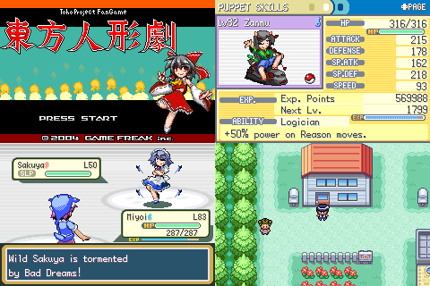

# Touhoumon Borderless

This is an adaptation + upgrade of Touhoumon 1.8.

## How to install

Download the most recent patch in Releases on Github.

Apply the patch file to FR 1.0 using NUPS.

There are many tutorials on patching online if you don't know how.

To identify which version of FR you have: if the intro says just "GAME FREAK" then you have 1.0, if it says "GAME FREAK Presents" then you have 1.1.

## About the game

This game uses a type chart unique to it. It is not the 1.8 type chart, though it is rather close to it.

Puppets have multiple styles they can evolve into, similar to 1.8. However, shards are no longer evolutionary stones. Instead, the Puppet must hold the shard when it reaches its usual evolution level. Only chibi puppets can evolve; once a Puppet evolves once, it's done.

Useful information can be found in the notes directory.

## FAQ

Q: Why is my Puppet picking up items?

A: Every Puppet has intrinsic Pickup in this game. Puppets that are higher-level and better trained tend to pick up better things, but usually just berries.

Certain species can also find different items. The Pickup ability gives the Puppet a chance to find man-made items in addition to regular ones.

Q: Can I change EVs/IVs/Nature/Ability?

A: Yes, but not from the start of the game.

## Credits

Original game: Game Freak

Disassembly: pret

Hacking, much of concept: Doesnt

Sprites: HemoglobinA1C, Scrimmy, Barudo, Reimufate, Blue, BluShell

Special Thanks: Kalt, Barudo, RedAlice, Darkge, Lotus, TheEeveeMan, LittleBigTrouble, nook

